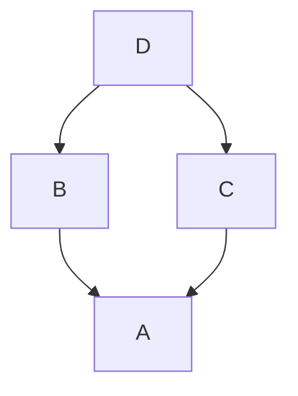

# TypeScript Cheatsheet

Code playground + notes from review of the [TypeScript handbook][ts-handbook]

<hr>

## Quickstart

- [tsdx][tsdx]
- [NestJS][nestjs]
- [Repo][tsconfig-starters] of recommended `tsconfig.json` starter files + example extension:

```json
{
  "extends": "@tsconfig/node12/tsconfig.json",
  "compilerOptions": {
    "preserveConstEnums": true
  },
  "include": ["src/**/*"],
  "exclude": ["node_modules", "**/*.spec.ts"]
}
```
- Bootstrap
```console
tsc --init
```

<hr>

## `tsc` Compiler

[Full docs][tsc-docs]

Running `tsc` locally will compile the closest project defined by a `tsconfig.json`, you can compile a set of TypeScript files by passing in a glob of files you want.

> <p style="color: red; display: inline">Important</p>: When input files are specified on the command line, tsconfig.json files are <b>ignored</b>.

The presence of a `tsconfig.json` file in a directory indicates that the directory is the root of a TypeScript project. The `tsconfig.json` file specifies the root files and the compiler options required to compile the project.

#### CLI commands

###### Compile: automatically detect project root

````console
tsc
````
- Compiler searches for the `tsconfig.json` file starting in the current directory and continuing up the parent directory chain.

###### Compile: manually specify project root

```console
tsc --project [path]
tsc -p [path]
```
- Compile the project given the `[path]` to its config file **or** to a folder with a `tsconfig.json`

###### Compile + debugging

```console
tsc --traceResolution
```
- Provides insight into what happened during the module resolution process

###### Debugging: Show all errors
```console
tsc --all
```

###### Debugging: Dry run (don't compile)
```console
tsc --listFilesOnly
```
- Print names of files that are part of the compilation and then stop processing.
```console
tsc --showConfig
```
- Print the final configuration instead of building.

#### Build commands

###### Builds
```console
tsc --build
tsc -b
```
- Build one or more projects and their dependencies, **if out of date**

###### Hard builds
```console
tsc -b --force
```
- Build all projects, including those that appear to be up to date.

###### Deletions
```console
tsc -b --clean
```
- Delete the outputs of all projects.

###### Debugging: Dry run (don't build)
```console
tsc -b --dry
```
- Show what would be built (or deleted, if specified with `--clean`)

###### Debugging: Logs
```console
tsc -b --verbose
```

<hr>

## API for `tsconfig.json` files

### <u>Top level configs</u>

#### *exclude*

- Specifies an array of filenames or patterns that should be skipped when resolving `include`.
> <p style="color: red; display: inline">Important</p>: exclude only changes which files are included as a result of the include setting.
- `exclude` is not a mechanism that prevents a file from being included in the codebase. A file specified by `exclude` can still become part of your codebase due to:

1. an import statement in your code
2. a types inclusion
3. a `/// <reference directive`, or
4. being specified in the files list.

#### *extends*

- The value of `extends` is a string which contains a path to another configuration file to inherit from
- The configuration from the base file are loaded first, then overridden by those in the inheriting config file. All relative paths found in the configuration file will be resolved relative to the configuration file they originated in.
- `files`, `include` and `exclude` from the inheriting config file overwrite those from the base config file
- The only top-level property that is excluded from inheritance is references.
- Circularity between configuration files is not allowed.
- Properties with relative paths found in the configuration file, which aren't excluded from inheritance, will be resolved relative to the configuration file they originated in.
- Examples:
1. `configs/base.json`
```json
{
  "compilerOptions": {
    "noImplicitAny": true,
    "strictNullChecks": true
  }
}
```
2. `tsconfig.json`
```json
{
  "extends": "./configs/base",
  "files": ["main.ts", "supplemental.ts"]
}
```
3. `tsconfig.nostrictnull.json`
```json
{
  "extends": "./tsconfig",
  "compilerOptions": {
    "strictNullChecks": false
  }
}
```

#### *files*

- Specifies an allowlist of files to include in the program.
- An error occurs if any of the files can't be found.
- Use when you only have a small number of files and don't need to use a glob to reference many files; otherwise use `include`.
- Example:
```json
{
  "compilerOptions": {},
  "files": [
    "core.ts",
    "sys.ts",
    "types.ts",
    "scanner.ts",
    "parser.ts",
    "utilities.ts",
    "binder.ts",
    "checker.ts",
    "tsc.ts"
  ]
}
```

#### *include*

- Specifies an array of filenames or patterns to include in the program.
- These filenames are resolved relative to the directory containing the tsconfig.json file.
- include and exclude support wildcard characters to make glob patterns. Rules:
1. `*` matches zero or more characters (excluding directory separators)
2. `?` matches any one character (excluding directory separators)
3. `**/` matches any directory nested to any level
- If a glob pattern doesn't include a file extension, then only files with supported extensions are included.
- Glob with no extension default: `.ts | .tsx | .d.ts`
- Glob with no extension if `allowJs` true: `.js | .jsx` as well.
- Example:
```json
{
  "include": ["src/**/*", "tests/**/*"]
}
```
- Would include:
```
├── scripts                ⨯
│   ├── lint.ts            ⨯
│   ├── update_deps.ts     ⨯
│   └── utils.ts           ⨯
├── src                    ✓
│   ├── client             ✓
│   │    ├── index.ts      ✓
│   │    └── utils.ts      ✓
│   ├── server             ✓
│   │    └── index.ts      ✓
├── tests                  ✓
│   ├── app.test.ts        ✓
│   ├── utils.ts           ✓
│   └── tests.d.ts         ✓
├── package.json
├── tsconfig.json
└── yarn.lock
```

#### *references*

- An array of objects that specifies projects to reference.  [Docs][ts-refs-docs].
- Example:
```json
{
  "compilerOptions": {  /* The usual */ },
  "references": [
    { "path": "../src" },
    { "path": "../foo" }
  ]
}
```

**Overview**
- When you reference a project, new things happen:
1. Importing modules from a referenced project will instead load its output declaration file (.d.ts)
2. If the referenced project produces an `outFile`, the output file .d.ts file's declarations will be visible in this project
3. Build mode (see below) will automatically build the referenced project if needed

**API: `path` property**
- The `path` property of each reference points to a `tsconfig.json` file. Targets either:
1. a **directory** containing a tsconfig.json file
2. the config file **itself**

**Usage notes: Basic setup**
- Referenced projects must have the new `composite ` compiler option enabled
- Recommended to enable `declarationMap`

**Usage notes: `prepend`**
- You can also enable prepending the output of a dependency using the `prepend` option in a reference:
```json
"references": [
  { "path": "../utils", "prepend": true }
]
```
- Prepending a project will include the project's output above the output of the current project.
- All output files (.js, .d.ts, .js.map, .d.ts.map) will be emitted correctly.
- `tsc` will only ever use existing files on disk to do this process, so it's possible to create a project where a correct output file can't be generated because some project's output would be present more than once in the resulting file.

- In this situation don't prepend at each reference to avoid  two copies of A in the output of D

**Caveats for Project References**
- Dependent projects make use of `.d.ts` files that are built from their dependencies
- This means before you can navigate the project in an editor without errors, you'll either have to:
1. check in build outputs or
2. build a project after cloning it
- VS Code has a behind-the-scenes in-memory .d.ts generation process that should be able to mitigate this, but it has perf implications
- For very large composite projects may need to disable this using `disableSourceOfProjectReferenceRedirect`
- `tsc` will not automatically build dependencies unless invoked with the `--build` switch to preserve compatibility with existing build workflows

**Build Mode for TypeScript**
- The --build flag is a new entry point for `tsc` that behaves more like a build orchestrator than a simple compiler.
- Does the following:
1. Find all referenced projects
2. Detect if they are up-to-date
3. Build out-of-date projects in the correct order
- You can provide `tsc -b` with one or more config file paths:
```console
tsc -b                            # Use the tsconfig.json in the current directory
tsc -b src                        # Use src/tsconfig.json
tsc -b foo/prd.tsconfig.json bar  # Use foo/prd.tsconfig.json and bar/tsconfig.json
```
- Specifying the config file name itself is unnecessary if it's named tsconfig.json (just like `tsc -p`)
- `tsc` will re-order the command line list of config files if needed to ensure dependencies are always built first

**Build Mode for TypeScript Caveates**
- Normally, `tsc` will produce outputs (.js and .d.ts) in the presence of syntax or type errors, unless `noEmitOnError` is on.
- Doing this in an incremental build system would be very bad.
- If one of your out-of-date dependencies had a new error, you'd only see it once
- A subsequent build would skip building the now up-to-date project.
- For this reason, tsc -b effectively acts as if noEmitOnError is enabled for all projects
- If you check in any build outputs (.js, .d.ts, .d.ts.map, etc.), you may need to run a `--force` build after certain source control operations depending on whether your source control tool preserves timestamps between the local copy and the remote copy.

**Guidance: Overall structure**
- With more `tsconfig.json` files, you'll usually want to use Configuration file inheritance to centralize your common compiler options.
- This way you can change a setting in one file rather than having to edit multiple files.
- Another good practice is to have a "solution" `tsconfig.json` file. Role:
1. Has references to all of your leaf-node projects, e.g. subprojects in `src/tsconfig.json`
2. Sets `files` to an empty array (otherwise the solution file will cause double compilation of files).
- This presents a simple entry point: in the TypeScript repo run `tsc -b src` to build all endpoints

**Guidance: Structuring for relative modules**
- Not much is needed to transition a repo using relative modules.
1. place a tsconfig.json file in each subdirectory of a given parent folder
2. Add references to these config files to match the intended layering of the program.
3. Update the tsconfigs.
-- Either set the `outDir` to an explicit subfolder of the output folder, or
-- Set the `rootDir` to the common root of all project folders

**Guidance: Structuring for `outFile`**

- Layout for compilations using outFile is more flexible because relative paths don't matter as much.
- One thing to keep in mind is that you'll generally want to not use prepend until the "last" project
- This will improve build times and reduce the amount of I/O needed in any given build
- The TypeScript repo itself is a good reference here - we have some "library" projects and some "endpoint" projects;
- "endpoint" projects are kept as small as possible and pull in only the libraries they need.

**Benefits**
- Assume following dir structure:
```
/
├── src/
│   ├── converter.ts
│   └── units.ts
├── test/
│   ├── converter-tests.ts
│   └── units-tests.ts
└── tsconfig.json
```
- Overall benefits of `references`:
1. Structure ts programs into smaller pieces
2. Reduce memory usage when using an editor
3. Increase speed of typechecking & compiling
4. Enforce logical separation between components
5. Can build `test` and `src` at the same time without having `src` appear in the output folder name
6. Can change just the internals in the implementation files without typechecking the tests again. (This wouldn't ever cause new errors)
7. If nothing changed in the implementation, we can change just the tests without typechecking the implementation again.
- Benefits over multiple tsconfig.json files:
8. There's no built-in up-to-date checking, so you end up always running `tsc` twice
9. Invoking `tsc` twice incurs more startup time overhead
10. `tsc -w` (watch-mode) can't run on multiple config files at once

**Production example: official TypeScript repo**
- **`src/tsconfig.json`**
```json
{
  "files": [],
  "include": [],
  "references": [
    { "path": "./shims" },
    { "path": "./tsc" },
    { "path": "./tsserver" },
    { "path": "./typingsInstaller" },
    { "path": "./watchGuard" },
    { "path": "./debug" },
    { "path": "./cancellationToken" },
    { "path": "./testRunner" }
  ]
}
```
[Souce][ts-ex-src-tsconfig]
- **`src/tsconfig-base.json`**
```json
{
  "compilerOptions": {
    "pretty": true,
    "lib": ["es2015.iterable", "es2015.generator", "es5"],
    "target": "es5",
    "moduleResolution": "node",
    "rootDir": ".",

    "declaration": true,
    "declarationMap": true,
    "sourceMap": true,
    "composite": true,
    "noEmitOnError": true,

    "strictNullChecks": true,
    "noImplicitAny": true,
    "noImplicitThis": true,
    "strictPropertyInitialization": true,
    "noUnusedLocals": true,
    "noUnusedParameters": true,

    "skipLibCheck": true,

    "alwaysStrict": true,
    "preserveConstEnums": true,
    "newLine": "lf",

    "types": []
  }
}
```
[Souce][ts-ex-src-tsconfig-base]
- **`src/tsconfig-noncomposite-base.json`**
```json
{
  "extends": "./tsconfig-base",
  "compilerOptions": {
    "declaration": false,
    "declarationMap": false,
    "composite": false,
    "incremental": true
  }
}
```
[Souce][ts-ex-src-tsconfig-nc-base]
- **`src/tsc/tsconfig.json`**
```json
{
  "extends": "../tsconfig-noncomposite-base",
  "compilerOptions": {
    "outFile": "../../built/local/tsc.js"
  },
  "files": [
    "tsc.ts"
  ],
  "references": [
    { "path": "../compiler", "prepend": true },
    { "path": "../executeCommandLine", "prepend": true }
  ]
}
```
[Souce][ts-ex-src-tsc-tsconfig]

### <u>compilerOptions configs</u>

###### allowJs

- When true, tells TypeScript to read JS files, as normally they are ignored as source files

###### composite

- Referenced projects must have the `composite` setting enabled
- Ensures TypeScript can quickly determine where to find the outputs of the referenced project
- Enabling the `composite` flag changes a few things:

1. The `rootDir` setting, if not explicitly set, defaults to the directory containing the tsconfig file.
2. All implementation files must be: matched by an include pattern **or** listed in the files array.
> If this constraint is violated, tsc will inform you which files weren't specified
3. `declaration` mode must be turned on

###### declaration

- When true, emits `.d.ts` files. Use for libraries.

###### declarationMap

- Generates a source map for `.d.ts` files which map back to the original `.ts` source file.
- This will allow editors such as VS Code to go to the original `.ts` file when using features like "Go to Definition".
- Use this on if you're using `references`.

###### emitDeclarationOnly

- When true, ensures `.d.ts` files are created by tsc, but not .js files
- Use when you want another transpiler (e.g. babel) to emit .js files

###### esModuleInterop

- By default (with esModuleInterop `false`) TypeScript treats CommonJS/AMD/UMD modules similar to ES6 modules.
- <p style="color: red; display: inline;">Issue:</p> The ES6 modules spec states a namespace import can only be an object. However, CommonJS allows an import to be treated as a function and be callable.
- When true, `esModuleInterop` fixes these import errors

###### isolatedModules

- When true, ensures each file can be safely transpiled without relying on other imports.
- Use so Babel can safely transpile files

###### module

- Sets the module system for the program
- Likely want `CommonJS` for node projects
- Defaults to `CommonJS` if `target` is `ES3` or `ES5`
- Defaults to `ES6` otherwise.

###### moduleResolution

- `node` option instructs TS to check node_modules folders

###### noEmitOnError

- Self-explanatory

###### noImplicitAny

- Self-explanatory

###### noUncheckedIndexedAccess

- See [example gotcha](/gotchas/indexed-access.ts)

###### rootDir

- When TypeScript compiles files, it keeps the same directory structure in the output directory as exists in the input directory
- `rootDir` does not affect which files become part of the compilation.
- It has no interaction with the `include`, `exclude`, or `files` `tsconfig.json` settings.
- `rootDir` defaults to the longest common path of all non-declaration input files.
- Assume we have a project with outDir `dist`:
```
├── tsconfig.json
├── core
│   ├── a.ts
│   ├── b.ts
│   ├── sub
│   │   ├── c.ts
├── types.d.ts
```
- By default, `rootDir` chosen by TypeScript is `core/`:
```
├── dist
│   ├── a.js
│   ├── b.js
│   ├── sub
│   │   ├── c.js
```
- Manually setting `rootDir` to `"."`:
```
├── dist
│   ├── core
│   │   ├── a.js
│   │   ├── b.js
│   │   ├── sub
│   │   │   ├── c.js
```

**Note: Scopes**

- TypeScript will never write an output file to a directory outside of outDir
- TypeScript will never skip emitting a file.
- For this reason, `rootDir` also enforces that all files which need to be emitted are underneath the `rootDir` path.
- If we added a file to the project at `/helpers.ts`, it would be an error to specify `rootDir` as `core/` and `include` as `"*"` because it creates a file `/helper.js` that would need to be emitted outside the `outDir`: `/dist/../helpers.js`.

**Note: Composite**

- If `composite` is set, the default `rootDir` is instead the **directory** containing the `tsconfig.json` file.


###### rootDirs

- Using `rootDirs`, you can inform the compiler that there are many "virtual" directories acting as a single root.
- This allows the compiler to resolve relative module imports within these "virtual" directories, as if they were merged in to one directory.
- This does not affect how TypeScript emits JavaScript, it only emulates the assumption that they will be able to work via those relative paths at runtime.
- Example:
```json
{
  "compilerOptions": {
    "rootDirs": ["src/views", "generated/templates/views"]
  }
}
```
- Enables:
```
src
└── views
  └── view1.ts (can import "./template1", "./view2`)
  └── view2.ts (can import "./template1", "./view1`)
generated
└── templates
  └── views
    └── template1.ts (can import "./view1", "./view2")
```

**Note: Non-code files**

- `rootDirs` can be used to provide a separate "type layer" to files that are not TypeScript or JavaScript by providing a home for generated .d.ts files in another folder.
- This technique is useful for bundled applications where you use import of files that aren't necessarily code.
- This technique lets you generate types ahead of time for the non-code source files.
- Imports then work naturally based off the source file's location.
- TypeScript will be aware of the bundler's behavior for that filetype via the corresponding generated declaration file.
- Example `src/index.ts` can import the file `src/css/main.cs`:
```json
{
  "compilerOptions": {
    "rootDirs": ["src", "generated"]
  }
}
```
- Enables:
```
src
└── index.ts
└── css
  └── main.css
  └── navigation.css
generated
└── css
  └── main.css.d.ts
  └── navigation.css.d.ts
```
```javascript
// @filename: src/index.ts
import { appClass } from "./css/main.css";
```

###### outDir

- Types should go into this directory.
- Removing this would place the .d.ts files next to the .js files
- Example: `"outDir": "dist"`

###### outFile

- If specified, all global (non-module) files will be concatenated into the single output file specified.
- If module is `system` or `amd`, all module files will also be concatenated into this file after all global content.
- `outFile` cannot be used unless module is `None`, `System`, or `AMD`.

###### sourceMap

- Tells ts to emit souce files for the transpiled JS.
- Useful if you want to add breakpoints to ts code in a browser for debugging

###### strictNullChecks

- Self-explanatory

###### strictPropertyInitialization

- Self-explanatory

###### target

- The target setting changes which JS features are downleveled and which are left intact.
- Use the [lib][lib-table] table to see which ES has the features you need then choose the target accordingly.

###### types
- If types is specified, only packages listed will be included in the global scope.
- Example: `"types": ["node", "jest", "express"]`

## Next steps

- Docker + TSQuickstar [Quickstart][ts-docker]

<!-- URLS -->
[ts-handbook]:https://www.typescriptlang.org/docs/handbook/intro.html
[tsdx]:https://tsdx.io/
[nestjs]:https://nestjs.com/
[tsconfig-starters]:https://github.com/tsconfig/bases#centralized-recommendations-for-tsconfig-bases
[tsc-docs]:https://www.typescriptlang.org/docs/handbook/compiler-options.html
[ts-refs-docs]:https://www.typescriptlang.org/docs/handbook/project-references.html
[lib-table]:https://www.typescriptlang.org/tsconfig#lib
[ts-ex-src-tsconfig]:https://github.com/microsoft/TypeScript/blob/main/src/tsconfig.json
[ts-ex-src-tsconfig-base]:https://github.com/microsoft/TypeScript/blob/main/src/tsconfig-base.json
[ts-ex-src-tsconfig-nc-base]:https://github.com/microsoft/TypeScript/blob/main/src/tsconfig-noncomposite-base.json
[ts-ex-src-tsc-tsconfig]:https://github.com/microsoft/TypeScript/blob/main/src/tsc/tsconfig.json
[ts-docker]:https://github.com/microsoft/TypeScript/wiki/Docker-Quickstart